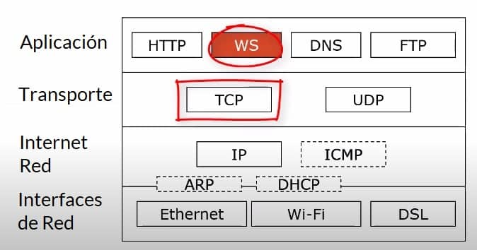
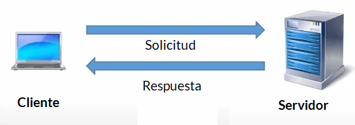
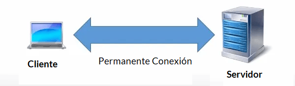

# Introduction

# Problem

El protocolo HTTP se utiliza para la web, que es un protocolo muy popular, ¿por qué necesitamos otro? El protocolo HTTP funciona en modo solicitud-respuesta. Un cliente envía una solicitud a un servidor, el servidor responde con una página web y la muestra en un navegador, por ejemplo.

Este modelo proporciona un protocolo muy sencillo, pero el inconveniente es que el servidor no puede enviar nada al cliente por voluntad propia, tiene que esperar a que el cliente envíe una petición/solicitud e incluir esos datos en la respuesta.

# WebSockets

Los WebSockets están diseñados para hacer precisamente eso. A diferencia de HTTP, los WebSockets establecen una conexión bidireccional persistente entre el cliente y el servidor. A través de esta conexión, el cliente puede enviar datos al servidor en cualquier momento, y el servidor puede enviar datos al cliente por iniciativa propia en cualquier momento.

Socket.io es una librería open source de JavaScript basada en el protocolo Websocket para Node. js que permite una comunicación TCP bidireccional en tiempo real entre clientes y servidor.

SignalR es una biblioteca de código abierto que simplifica la creación de aplicaciones web en tiempo real y permite la comunicación bidireccional entre el cliente y el servidor a través de varios protocolos como WebSockets, Server-Sent Events y Long Polling.

# SignalR Vs. Socket.IO

Tanto SignalR como Socket.IO son útiles para crear aplicaciones en tiempo real. Por lo tanto, Socket.IO y SignalR son ideales para casos de uso como:

- Paneles de control en tiempo real
- Aplicaciones de mensajería y chat en vivo
- Colaboración multijugador
- Actualizaciones de ubicación en tiempo real
- Notificaciones dentro de la aplicación
- Juegos multijugador
- Transmisión de actualizaciones de alta frecuencia
- Para obtener una descripción detallada, analicemos los usos individuales de SignalR y Socket.IO.

## What Is SignalR ?

Es una biblioteca de código abierto que simplifica la adición de funcionalidad web en tiempo real a las aplicaciones. La funcionalidad web en tiempo real permite que el código del lado del servidor envíe contenido a los clientes al instante.

Docs: [SignalR](https://learn.microsoft.com/en-us/aspnet/signalr/)

### Transporte
SignalR admite las siguientes técnicas para manejar la comunicación en tiempo real (en orden de reserva):

- WebSockets
- Eventos enviados por el servidor
- Sondeo largo

SignalR elige automáticamente el mejor método de transporte que está dentro de las capacidades del servidor y el cliente.

### Hubs
SignalR usa concentradores o hubs para comunicarse entre clientes y servidores.

Un concentrador es una canalización de alto nivel que permite a un cliente y un servidor llamar a métodos entre sí. SignalR maneja el envío a través de los límites de la máquina automáticamente, lo que permite a los clientes llamar a métodos en el servidor y viceversa. Puede pasar parámetros fuertemente tipados a métodos, lo que habilita el enlace de modelos. 

## What Is Socket.IO ?

Es una biblioteca de JavaScript que permite una comunicación bidireccional en tiempo real entre el servidor y los clientes web.

Docs: [Socket.IO](https://socket.io/docs/v4/)

### Cómo funciona Socket IO

Para comprender cómo funciona Socket IO, primero debemos entender cómo se establece una conexión entre el servidor y los clientes.

#### Estableciendo la conexión
Cuando un cliente intenta conectarse al servidor mediante Socket.IO, se inicia un proceso de negociación entre ambos extremos para determinar el mejor método de comunicación. En este proceso, Socket IO verifica si el cliente es compatible con WebSockets. Si es así, se establece una conexión WebSocket. Si el cliente no admite WebSockets, Socket IO utiliza otras técnicas, como long polling o Server-Sent Events (SSE), para lograr la conexión.

#### Comunicación bidireccional
Una vez establecida la conexión, Socket IO permite una comunicación bidireccional continua. Los clientes pueden enviar eventos al servidor y el servidor puede enviar eventos a los clientes.

#### Eventos y emisores
En Socket IO, los eventos juegan un papel fundamental. Los clientes y el servidor pueden definir y escuchar eventos específicos. Por ejemplo, un cliente puede enviar un evento de «nuevo mensaje» al servidor, y este puede propagar el mensaje a todos los clientes conectados.

#### Manejo de conexiones
Socket IO facilita el seguimiento de las conexiones de los clientes con el servidor. Puede mantener una lista de «clientes conectados» y administrar su estado en tiempo real.

#### Escalabilidad con múltiples servidores
Una ventaja significativa de Socket.IO es su capacidad para escalar a aplicaciones con múltiples servidores. Socket.IO utiliza una combinación de almacenamiento en memoria y almacenamiento en disco para garantizar que los eventos se propaguen a todos los servidores conectados. Esto asegura que los clientes puedan comunicarse sin problemas, incluso si la aplicación se distribuye en varios servidores.

## SignalR vs. Socket.IO: Detailed Comparison

| SignalR | Socket.IO |
|----------|----------|
| Biblioteca de código abierto (ASP.NET Core SignalR) y producto basado en la nube (Azure SignalR).    | Solución de código abierto   |
| También admite un tercer transporte: eventos enviados por el servidor junto con WebSockets y sondeo largo HTTP.   | Solo admite WebSockets y sondeos largos HTTP.  |
| Una opción ideal para usar .NET en el lado del servidor.    | Adecuado para usar Node.js en el lado del servidor.   |
| Ofrecer múltiples integraciones    | Ofrece integraciones mínimas.   |

## Final verdict

Tanto SignalR como Socket.IO son prometedores y tienen sus pros y sus contras. Por lo tanto, asegúrese de considerar sus necesidades y preferencias para la creación de su aplicación web al elegir el marco.

Una vez que haya decidido el marco adecuado para su aplicación web, es hora de desarrollarla.

This project is a starting point for a Flutter application.

A few resources to get you started if this is your first Flutter project:

- [Lab: Write your first Flutter app](https://docs.flutter.dev/get-started/codelab)
- [Cookbook: Useful Flutter samples](https://docs.flutter.dev/cookbook)

For help getting started with Flutter development, view the
[online documentation](https://docs.flutter.dev/), which offers tutorials,
samples, guidance on mobile development, and a full API reference.
